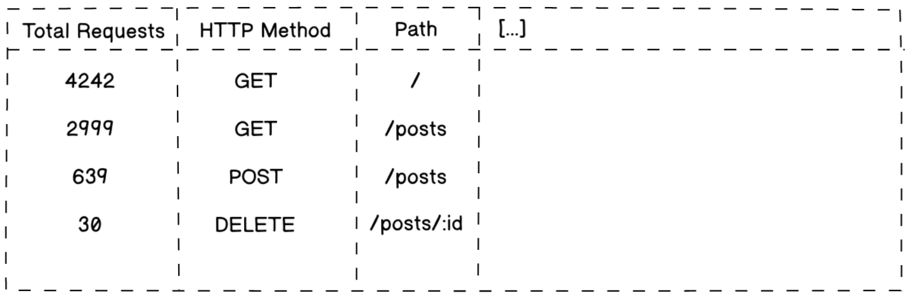

# Processo Seletivo 42 São Paulo: 42Labs 2ª edição

Nesse desafio você vai construir duas aplicações utilizando C: uma [API](#) e
uma aplicação de interface de linha de comando([CLI](#)).

## API

A API que você irá construir poderá lidar com dados com formato e origem de sua
escolha. Um exemplo seria fazer uma API que retorna o conteúdo de postagens de
um blog.

É necessário:

- Que sua API esteja de acordo com o modelo de arquitetura _REST_
- Implementar pelo menos uma requisição do método `GET` no path `/`, retornando
  alguma informação no formato JSON e status HTTP `200 OK`
- Registrar logs em um arquivo; guardando informações sobre todas as requisições
  e respostas(e.g. horário da requisição, método, etc.)
  
## Aplicação CLI

A aplicação CLI que você irá construir deverá consumir e processar o arquivo de
logs gerado pela API REST. 

É necessário:

- Que sua aplicação agrupe os dados dos logs e os mostrem de maneira legível no terminal
- Que os dados possibilitem uma análise sobre as requisições

## O que será avaliado

- Código bem escrito e limpo
- A documentação do seu código
- Quais ferramentas foram usadas e por quê
- Sua criatividade e capacidade de lidar com problemas diferentes
- Se seu projeto está alinhado com o que foi proposto

## O mínimo necessário

- README.md com documentação contendo informações do projeto.

## Bônus

Os seguintes itens não são obrigatórios, porém dão mais valor ao seu trabalho.
Os destacados são mais significativos para nós.

- **Testes**
- **Conteinerização das aplicações**
- **API com conexão a um banco de dados(SQL ou NoSQL, sua escolha)**
- **Parseamento de argumentos UNIX-like, podendo filtrar ou alterar comportamentos da aplicação(CLI)**
- Cache básico(caso sua API se comunique com banco de dados)
- Autenticação e autorização(API)
- Lidar com requests simultâneos(API)
- Cuidados especiais com otimização, padrões, entre outros
- Pipelines de CI/CD
- Utilização de algum serviço de computação na nuvem
- Uso de ferramentas externas para diagramação e/ou planejamento das etapas de desenvolvimento
